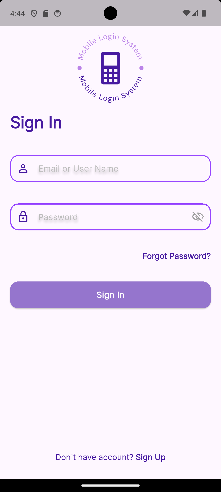
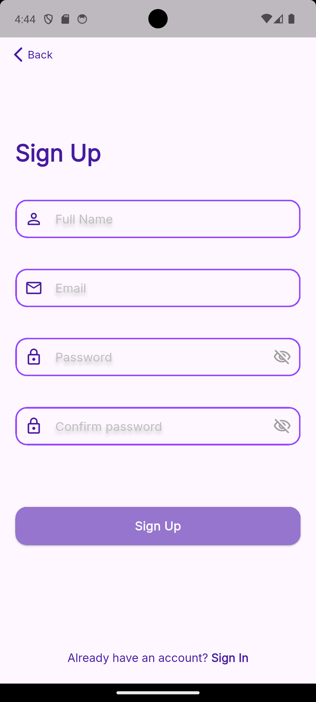
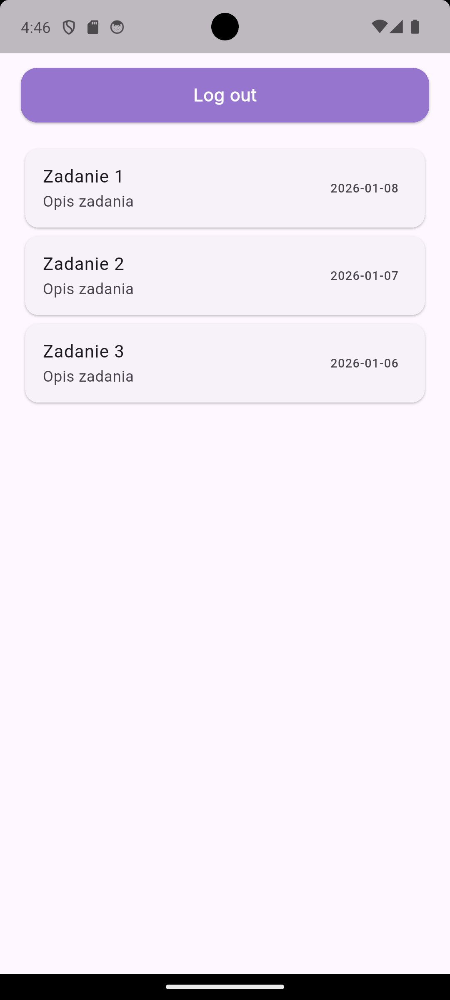

# Flutter ToDo App

A simple Flutter mobile app for registering, logging in, and viewing tasks.  

<div style="display: flex;">



</div>

## Features
- Sign in & sign up
- View example tasks
- Logout functionality

## Built With
- Flutter & Dart
- Shared Preferences for local storage

## Running the App
```bash
git clone https://github.com/ajamajai/mobile-app.git
cd mobile-app
flutter pub get
flutter run
